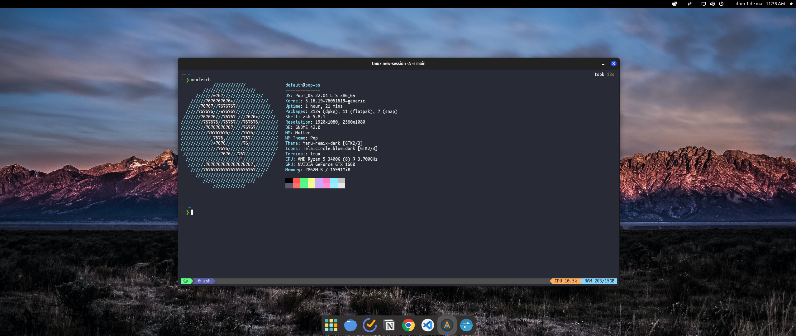

<h1 align="center">Dotfiles 👨‍🎓 </h1>
Descrição: Meus arquivos de configuração do Pop OS 22.04 e o script de instalação das ferramentas que eu uso.

## Apps e ferramentas que eu uso

- alacritty
- neovim
- git
- tmux
- zsh
- google-chrome
- beekeper-studio
- keepassxc
- discord
- slack
- docker
- insomnia
- github-cli

### Autor

👤 **Daniel Ribeiro**

- Twitter: [@defauth8](https://twitter.com/defauth8)
- Github: [@defauth98](https://github.com/defauth98)
- LinkedIn: [@daniel-ribeiro-397604164](https://linkedin.com/in/daniel-ribeiro-397604164)
