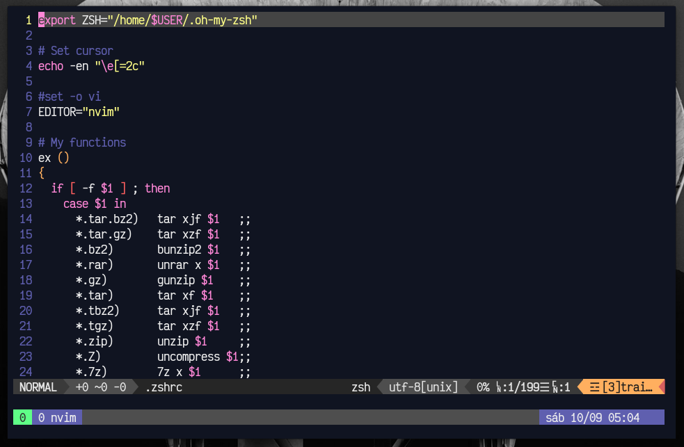

<h1 align="center">Dotfiles 👨‍🎓 </h1>

Meus arquivos de configuração do Pop OS 21.10 e o script de instalação das ferramentas que eu uso.

### Lista de apps
- alacritty
- neovim
- git
- tmux
- zsh

### Autor

👤 **Daniel Ribeiro**

- Twitter: [@defauth8](https://twitter.com/defauth8)
- Github: [@defauth98](https://github.com/defauth98)
- LinkedIn: [@daniel-ribeiro-397604164](https://linkedin.com/in/daniel-ribeiro-397604164)

